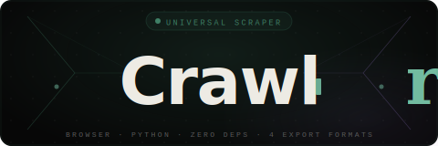

<div align="center">



<br/>

[](https://saksham653.github.io/web-crawlr/)
[](https://github.com/Saksham653/web-crawlr)
[](mailto:sakshamsrivastava7000@gmail.com)
[](https://www.python.org/)
[]()

</div>

---

```
  Scraping → https://books.toscrape.com

  [1/3] Fetching page…
  [2/3] Parsing HTML structure…
  [3/3] Writing output…

  ✓ Complete
      Headings    42
      Paragraphs  18
      Links       94
      Images      61
      Prices      50  ← ₹ $ £ € ¥ detected
      Saved →     output/result.json
```

---

## What is Crawlr?

**Crawlr** is a universal web scraper that works in two ways — paste a URL in your browser and get instant results, or run the Python CLI locally for more power. No configuration, no selectors to write, no dependencies to install. Just point it at any URL and get back clean, structured data across six categories — ready to search, filter, and export.

Built entirely from scratch. Every line of HTML, CSS, JavaScript and Python written by hand. Zero external libraries, start to finish.

---

## ✦ Feature Highlights

### 🔍 Six Data Types — Automatically Detected

| Category | What it captures |
|----------|-----------------|
| **Headings** | h1–h6 with level badges — H1 in gold, H2 in teal, H3–H6 in muted tones |
| **Paragraphs** | All `<p>` blocks over 40 chars — deduplicated, trimmed, fully searchable |
| **Links** | Every href resolved to absolute URL — internal vs external flagged automatically |
| **Images** | `src` + `alt` text — handles `data-src` and lazy-loaded attributes |
| **Prices** | Regex-matched ₹ $ £ € ¥ amounts — parsed to numeric values for comparison |
| **Meta Tags** | Open Graph, Twitter Cards, `description`, `keywords`, charset — full `<meta>` table |

### 📊 Price Tracker
Track any product URL over time. Set a target price, hit refresh — Crawlr fetches the latest price, stores history, and renders sparkline charts inline. A **TARGET HIT** badge fires when your price is reached. All data persists in `localStorage` across sessions. Export your tracking history as CSV at any time.

### 📥 Four Export Formats
Choose exactly which sections to include with checkboxes. Preview the output live before downloading. Files are named automatically with domain + date.

| Format | Best for |
|--------|----------|
| **JSON** | APIs, developer pipelines, structured data |
| **CSV** | Excel, Google Sheets, flat row analysis |
| **Markdown** | GitHub, Notion, Obsidian, readable reports |
| **HTML** | Standalone shareable pages, archiving |

### ⚡ Dual Scraper Modes

**Browser Mode** — No install needed. Paste any URL and go. Uses a 3-proxy fallback chain (`allorigins.win → corsproxy.io → codetabs.com`), each with a 10-second timeout. Usually resolves in 2–5 seconds.

**Python Mode** — Run locally for sites that block proxies. Zero pip installs — pure Python stdlib. Spoofed `User-Agent` headers bypass most basic bot detectors. The dashboard auto-detects `output/result.json` on startup and populates all 8 tabs automatically.

---

## 🚀 Quick Start

### Option A — Browser (No Install)

Open the live app and paste any URL:

**[→ Launch Crawlr](https://saksham653.github.io/web-crawlr/)**

Or open `frontend/index.html` locally in any browser.

### Option B — Python CLI

```bash
# Clone the repo
git clone https://github.com/Saksham653/web-crawlr.git
cd web-crawlr

# Run the scraper (zero pip installs — stdlib only)
python scraper.py https://example.com

# Output saved to output/result.json
# Open frontend/index.html → auto-loads all results
```

Optional args:
```bash
python scraper.py https://example.com -o my-output.json
```

---

## 🗂 Project Structure

```
web-crawlr/
├── scraper.py          ← Python CLI scraper (zero dependencies)
├── frontend/
│   └── index.html      ← Full dashboard UI (8 tabs, search, export)
├── output/
│   └── result.json     ← Generated after running scraper.py
└── README.md
```

---

## 🛠 Tech Stack

Built deliberately minimal — no npm, no frameworks, no build step.

| Layer | Technology | Notes |
|-------|-----------|-------|
| Frontend | Vanilla HTML + CSS + JS | Zero npm packages, zero build step |
| Typography | Syne · Lora · Fira Code | Google Fonts |
| Python Scraper | Python 3.8+ stdlib | `urllib`, `html.parser`, `json`, `re` |
| CORS Proxies | allorigins · corsproxy · codetabs | Auto-fallback chain |
| Data Storage | `localStorage` + JSON on disk | No servers, no accounts |
| Export Engine | Blob + `URL.createObjectURL` | Native browser APIs only |
| Inspiration | Scrapy 2.14 | Spider → Item → Pipeline philosophy |

---

## ✅ Works Great On

- **Wikipedia** — full articles, all headings, all links
- **GitHub** — repo pages, README content, file listings
- **Hacker News** — posts, titles, comment links
- **News sites** — BBC, Reuters, The Hindu, NDTV
- **Blogs & documentation** — any server-rendered HTML
- **books.toscrape.com** — the classic scraping practice site
- **Static e-commerce** — prices, images, product descriptions

## ⚠️ Known Limitations

- **Flipkart / Amazon India** — Cloudflare blocks all public proxies
- **React / Vue / Angular SPAs** — JS-rendered pages return an empty HTML shell
- **Login-gated content** — requires an authenticated session
- **PDFs & image files** — no document or OCR support
- **Cloudflare-protected sites** — requires a headless browser (Playwright / Puppeteer)

---

## 🕸 How It Works

```
  URL Input
      │
      ▼
  ┌─────────────────────────────────┐
  │   CORS Proxy Fallback Chain     │
  │   allorigins → corsproxy        │
  │              → codetabs         │
  │   (each: 10s AbortSignal)       │
  └─────────────┬───────────────────┘
                │
                ▼
  ┌─────────────────────────────────┐
  │   UniversalParser               │
  │   HTMLParser (stdlib)           │
  │   → Headings  → Paragraphs      │
  │   → Links     → Images          │
  │   → Prices    → Meta            │
  └─────────────┬───────────────────┘
                │
                ▼
  ┌─────────────────────────────────┐
  │   Dashboard (8 tabs)            │
  │   Live search · Stats strip     │
  │   Price tracker · Export        │
  └─────────────────────────────────┘
```

---

## 👤 Author

<div align="center">

**Saksham Srivastava**

*Web scraping · Python · Vanilla frontend*

Built Crawlr as a full-stack web scraping project using Python and vanilla web technologies — designed around the Scrapy framework's philosophy of clean data extraction, structured pipelines, and portable output formats. Every line of code, every design decision, and every feature was built from scratch.

[](https://github.com/Saksham653)
[](mailto:sakshamsrivastava7000@gmail.com)
[](https://saksham653.github.io/web-crawlr/)

</div>

---

<div align="center">

© 2026 Saksham Srivastava &nbsp;·&nbsp; Crawlr v2 — Universal Web Scraper

*Zero dependencies. Start to finish.*

</div>
